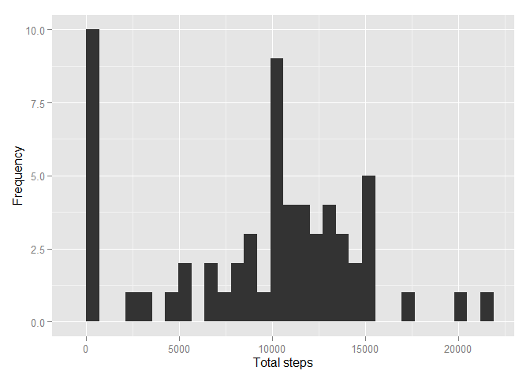

# Reproducible Research: Peer Assessment 1

## Loading and preprocessing the data

### Read data


```r
if(!file.exists('activity.csv')){
    unzip('activity.zip')
}
activity <- read.csv('activity.csv')
```

### Create a date.time column that combines the date and interval columns.


```r
time <- formatC(activity$interval / 100, 2, format='f')
activity$date.time <- as.POSIXct(paste(activity$date, time),
                                 format='%Y-%m-%d %H.%M',
                                 tz='GMT')
```

### convert all of the dates to be for today to find the mean in different of day.


```r
activity$time <- format(activity$date.time, format='%H:%M:%S')
activity$time <- as.POSIXct(activity$time, format='%H:%M:%S')
```


## What is mean total number of steps taken per day? 

### Calculate the total number of steps taken per day


```r
total.steps <- tapply(activity$steps, activity$date, sum, na.rm=TRUE)
```

### Mean and median of the total number of steps taken per day:


```r
mean(total.steps)
```

[1] 9354.23

```r
median(total.steps)
```

[1] 10395

### Plot the Distribution of total number of steps taken per day:


```r
library(ggplot2)
```

```
## Warning: package 'ggplot2' was built under R version 3.1.3
```

```r
qplot(total.steps, xlab='Total steps', ylab='Frequency')
```

 


## What is the average daily activity pattern?

### Calculate the mean steps for each five minute interval, and then put it in a data frame.

```r
mean.steps <- tapply(activity$steps, activity$time, mean, na.rm=TRUE)
daily.pattern <- data.frame(time=as.POSIXct(names(mean.steps)),
                            mean.steps=mean.steps)
```

###Let's take a look at a time series plot for the mean steps.

```r
library(scales)
```

```
## Warning: package 'scales' was built under R version 3.1.3
```

```r
ggplot(daily.pattern, aes(time, mean.steps)) + 
    geom_line() +
    xlab('Time of day') +
    ylab('Mean number of steps') +
    scale_x_datetime(labels=date_format(format='%H:%M'))
```

 

### Which five minute interval has the highest mean number of steps?

```r
most <- which.max(daily.pattern$mean.steps)
format(daily.pattern[most,'time'], format='%H:%M')
```

[1] "08:35"


## Input missing values

### Identify the number of intervals with missing step counts ("NA's"):


```r
summary(activity$steps)
```

   Min. 1st Qu.  Median    Mean 3rd Qu.    Max.    NA's 
   0.00    0.00    0.00   37.38   12.00  806.00    2304 

### use mean steps for a five-minute interval for the entire dataset to fill in the missing values.

```r
library(Hmisc)
```

```
## Warning: package 'Hmisc' was built under R version 3.1.3
```

```
## Loading required package: grid
## Loading required package: lattice
## Loading required package: survival
## Loading required package: splines
## Loading required package: Formula
```

```
## Warning: package 'Formula' was built under R version 3.1.3
```

```
## 
## Attaching package: 'Hmisc'
## 
## The following objects are masked from 'package:base':
## 
##     format.pval, round.POSIXt, trunc.POSIXt, units
```

```r
activity.imputed <- activity
activity.imputed$steps <- with(activity.imputed, impute(steps, mean))
```

### Let's compare the mean and median steps for each day between the original data set and the input data set.

```r
total.steps.imputed <- tapply(activity.imputed$steps, 
                              activity.imputed$date, sum)
mean(total.steps)
```

[1] 9354.23

```r
mean(total.steps.imputed)
```

[1] 10766.19

```r
median(total.steps)
```

[1] 10395

```r
median(total.steps.imputed)
```

[1] 10766.19

### Plot data set.

```r
qplot(total.steps.imputed, xlab='Total steps', ylab='Frequency')
```

 


## Are there differences in activity patterns between weekdays and weekends?

### Add a factor column for whether a day is a weekday or weekend

```r
day.type <- function(date) {
    if (weekdays(date) %in% c('Saturday', 'Sunday')) {
        return('weekend')
    } else {
        return('weekday')
    }
}

day.types <- sapply(activity.imputed$date.time, day.type)
activity.imputed$day.type <- as.factor(day.types)
```

### Create a dataframe that holds the mean steps for weekdays and weekends.

```r
mean.steps <- tapply(activity.imputed$steps, 
                     interaction(activity.imputed$time,
                                 activity.imputed$day.type),
                     mean, na.rm=TRUE)
day.type.pattern <- data.frame(time=as.POSIXct(names(mean.steps)),
                               mean.steps=mean.steps,
                               day.type=as.factor(c(rep('weekday', 288),
                                                   rep('weekend', 288))))
```

### Now let's compare the patterns between weekdays and weekends.

```r
ggplot(day.type.pattern, aes(time, mean.steps)) + 
    geom_line() +
    xlab('Time of day') +
    ylab('Mean number of steps') +
    scale_x_datetime(labels=date_format(format='%H:%M')) +
    facet_grid(. ~ day.type)
```

 
